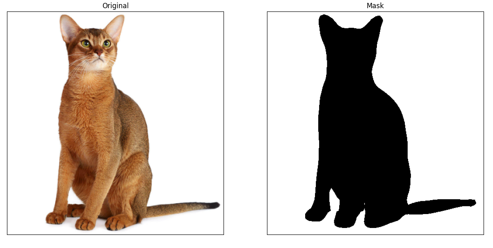
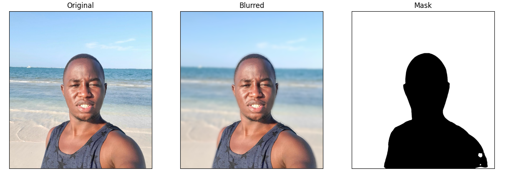
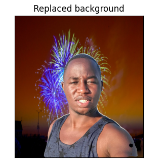

# Image Segmentation

## Overview
This project implements background segmentation and replacement using *DeepLabV3 (ResNet-101)*, a state-of-the-art deep learning model for semantic segmentation. The application processes an input image, blurs the background and in the final step, replaces it with another image.

## Segmentation Pipeline
### Step 1: Read and Process Image
The input image is read using OpenCV and the DeepLabV3 model is used to generate segmentation masks.

### Step 2: Generate a Mask
A binary mask is created where background pixels are set to *True (value = 0)* and object pixels are set to *False*.

### Step 3: Apply Background Blur
To blur only the background while keeping the subject intact.

## Background Replacement
### Step 1: Read and Resize Background Image
Instead of blurring, we can replace the background with a new image. Here is the background:

### Step 2: Apply New Background

## Contact

For any questions or collaboration opportunities, feel free to reach out at [hey@njoguevans.me](mailto:hey@njoguevans.me).
